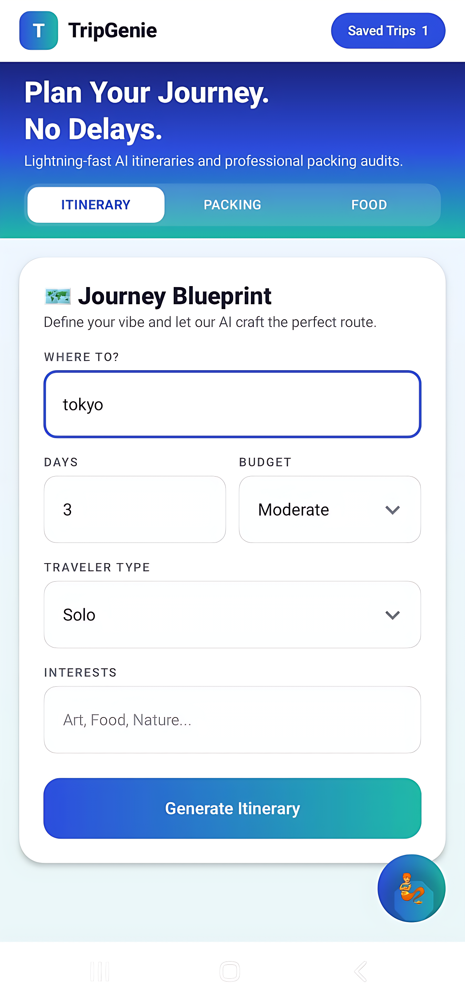
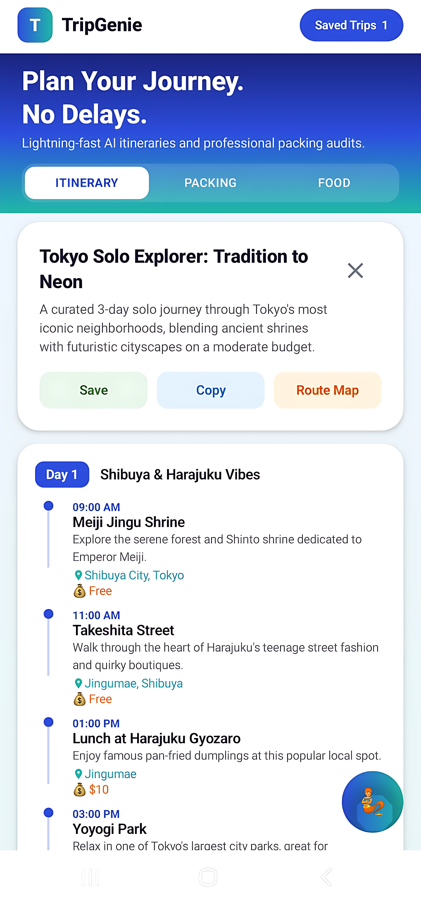
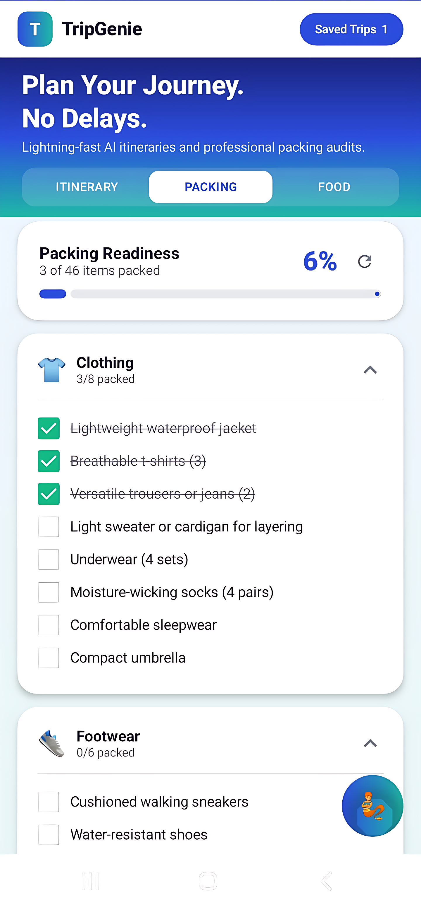
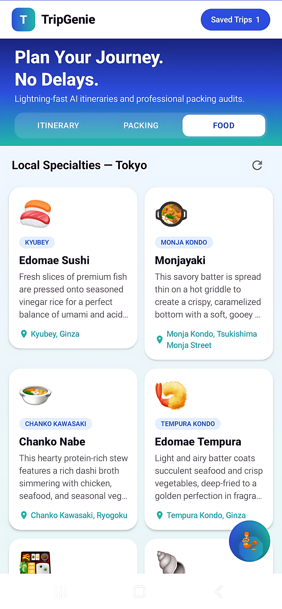
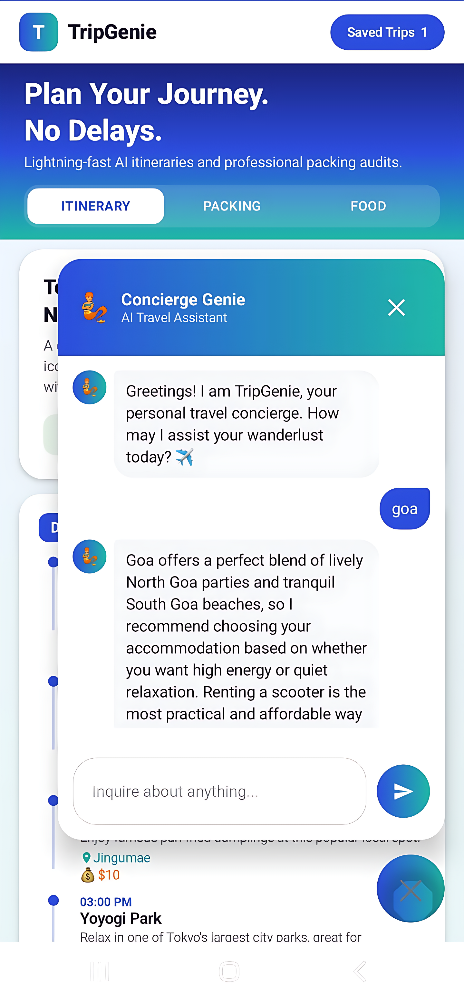
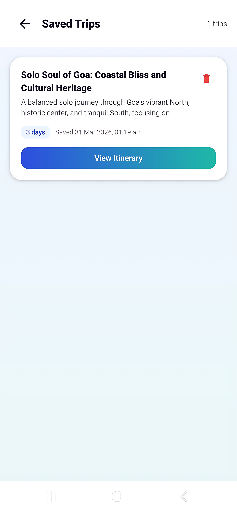

# TripGenie

TripGenie is an AI-powered travel planning Android app that generates personalized itineraries, packing lists, local food guides, and offers a travel assistant chatbot. The project consists of a FastAPI backend and a modern Android frontend built with Kotlin and Jetpack Compose.

## Screenshots

<p align="center">
        
        
        
        
        
        
</p>

## Features

| Feature            | Description                                                                                 |
|--------------------|---------------------------------------------------------------------------------------------|
| Itinerary Generator| Day-by-day travel plan with real activities, GPS locations, and budget breakdown            |
| Packing List       | Smart checklist with progress tracking, tailored to weather and activities                  |
| Local Food Guide   | Authentic dishes and real restaurant recommendations for any region                         |
| Travel Chatbot     | Concierge Genie — AI assistant for travel tips, logistics, and local insights               |
| Saved Trips        | Save and revisit generated itineraries offline                                              |


## Tech Stack

**Frontend (Android):**
- Kotlin, Jetpack Compose
- MVVM architecture (ViewModel + StateFlow)
- OkHttp for HTTP requests
- Coroutines for async operations

**Backend (Python):**
- FastAPI
- Google Generative AI SDK
- Pydantic for request/response validation
- Deployed on Render (free tier)
- Automatic model fallback across Gemini versions

## Architecture

```
Android App (Kotlin + Jetpack Compose)
        |
        |  HTTP — OkHttp
        v
FastAPI Backend (Python) — deployed on Render
        |
        |  Google AI SDK
        v
Google Gemini API
```

*Note: The Gemini API key is stored only on the backend server. It is never bundled inside the APK.*

## How It Works
1. User enters trip details in the Android app.
2. The app sends requests to the backend (deployed on Render or locally).
3. The backend generates responses using Gemini and returns structured JSON.
4. The app displays results in a modern, responsive UI.

## Repository Structure

```
TripGenie/
├── frontend/     # Android app — Kotlin, Jetpack Compose, MVVM
├── backend/      # FastAPI server — Gemini integration, REST endpoints
└── screenshots/  # App screenshots used in README
```

See the `backend/README.md` and `frontend/README.md` files for setup instructions.

